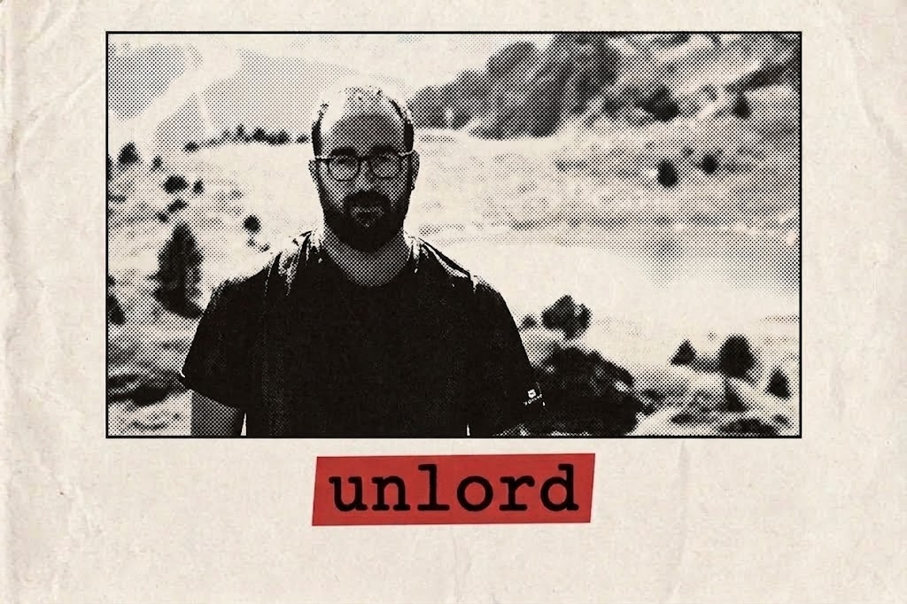

Me gradué en Educación Social por la Universitat Oberta de Catalunya (UOC) y, antes de eso, me formé como técnico forestal. Sí, un perfil entre la gestión del medio natural y la intervención social. En el fondo, ambas disciplinas comparten más de lo que parece: se trata de observar bien el entorno, gestionar momentos de crisis y recordar que casi siempre vale más prevenir que tener que apagar el incendio después.

Me defino como activista por la educación crítica y defensor acérrimo de la **pedagogía hacker**. Cada vez que digo que defiendo la pedagogía hacker hay alguien que se imagina a un adolescente con capucha tumbando el Pentágono desde el sótano de su madre. No va de eso. Va de defender un aprendizaje que va más allá de consumir respuestas hechas. Se trata de pasar de ser meros usuarios pasivos a agentes capaces de cuestionar cómo están construidas las cosas, fomentando la autonomía para entender, auditar y transformar la tecnología y el conocimiento al servicio de las personas. De entender que detrás de cada interfaz amable hay decisiones que alguien tomó, con unos intereses concretos, y que esas decisiones se pueden discutir.

Me fascina la interacción entre la tecnología y la sociedad. Paso buena parte de mi tiempo reflexionando e investigando sobre:

## Sociedades virtuales:

Porque la sociedad contemporánea ya no distingue entre «vida digital» y «vida real». Los entornos **online** no son una simulación ni una evasión del mundo físico, sino un espacio donde se articulan nuevas comunidades, formas de cultura, poder y contradicciones perfectamente reales. La gente construye comunidad en los sitios más improbables, y suele funcionar mejor de lo que los sociólogos predijeron.

## Decrecimiento: 

Porque la idea de crecer infinitamente en un planeta finito suena genial en una plantilla de Excel, pero bastante reguleras en la realidad.

## Sesgos algorítmicos:

Descifrando por qué las máquinas, siendo supuestamente objetivas, acaban reproduciendo las mismas mañas y prejuicios de quienes las programan. El problema no es que la máquina sea malvada. El problema es que es **obediente**. Hace exactamente lo que se le pidió, con los datos que se le dieron, para el objetivo que alguien fijó. Si el resultado es injusto, la máquina no ha fallado: **ha funcionado**.

## Tecnologías libres:

La **infraestructura digital** no debería ser una caja negra inauditable. Defiendo el **código abierto** y los estándares libres como una garantía básica de soberanía tecnológica, privacidad y cooperación comunitaria.

## Contralgoritmia:

Aquí no hay **algoritmo** que decida si esto te llega. No hay métricas que me digan qué debería escribir para gustar más. No hay nadie optimizando tu atención, entre otras cosas porque no hay nada que optimizar: son textos largos sobre temas que no interesan a casi nadie, y esa es precisamente la gracia.
Si has llegado hasta aquí, ya somos dos personas raras.

Si quieres discutir algo de lo que has leído, corregirme —pasa, y agradezco que pase— o simplemente comentar, mi correo está en la portada.

