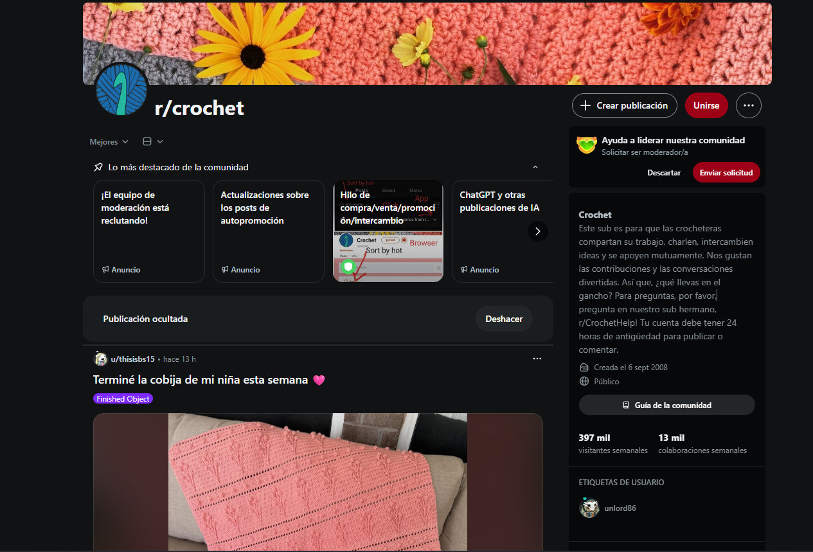

### **Estudi de cas: L'impacte terapèutic de les comunitats en línia en la millora del benestar emocional. El cas de la Sra. Maria Ferrer.**

***

## Introducció.

Aquest estudi de cas explora els efectes terapèutics de les comunitats en línia com a recurs per a la intervenció socioeducativa. Els educadors socials poden utilitzar plataformes digitals per fomentar vincles positius, especialment apropiats en contextos de vulnerabilitat emocional i aïllament social de les persones i, així, reduir els riscos associats a l’aïllament promovent l’empoderament personal.

El cas es basa en una intervenció (fictícia) realitzada en un entorn rural, on les oportunitats presencials i ofertes culturals són limitades. 

Aquest exemple il·lustra com un acompanyament segur entre el món digital i el real pot transformar la trajectòria d’una persona diagnosticada amb depressió.

La persona del cas és la Sra. Maria Ferrer, una dona de seixanta-dos anys resident a un petit poble de la comarca del Priorat (Catalunya). El seu passatemps favorit és el teixit amb ganxet (crochet). Una activitat creativa que permet l’intercanvi de patrons, materials i creacions amb plataformes molt actives com Reddit (subreddit [r/crochet](https://www.reddit.com/r/crochet/)).

***

## Antecedents del cas.

La Sra. Maria Ferrer és una vídua des de fa cinc anys d’ençà que el seu marit traspassés després d’una llarga malaltia. Sense fills ni familiars propers, el seu teixit social i comunitari és mínim. Viu en un poble de menys de 500 habitants on les activitats socials i culturals són escasses i centrades en tradicions locals que no li interessen gaire. Des de la mort del seu marit Josep, ha desenvolupat una depressió major diagnosticada clínicament i tractada amb medicació antidepressiva (principalment sertralina) prescrita per un metge de capçalera i un psiquiatre de l’hospital comarcal.

Les intervencions prèvies, incloent-hi la teràpia cognitivoconductual en sessions individuals i grupals, no han tingut l’èxit desitjat. La Sra. Ferrer ha manifestat una manca de motivació persistent, insomni, baixa autoestima i un sentiment d’aïllament profund que s'ha agreujat per la manca d’oportunitats locals per connectar amb altres persones.

Durant una avaluació inicial realitzada per l’educador social assignat (un professional del servei d’atenció primària del municipi), es va identificar que l’únic element motivador en la vida de la Sra. Ferrer era el seu amor pel teixit de ganxet.  Aquesta tècnica l’havia après de la seva àvia durant la seva infància i l’havia practicat durant dècades fent mantes, bufandes i decoracions per casa. Com a conseqüència de la tristesa que sentia, aquesta activitat l’havia abandonat progressivament, argumentant una manca d’energia i de propòsit.

En el poble, no existia cap grup o taller relacionat amb el teixit de ganxet i la Sra. Ferrer mai havia considerat opcions alternatives perquè no estava gens familiaritzada amb les tecnologies digitals més enllà de l’ús bàsic del telèfon mòbil.

***

## Intervenció de l'educador social.

L’educador social, especialitzat en educació crítica de la cultura digital i prevenció de riscos en l’entorn en línia, va reconèixer el potencial terapèutic de les comunitats digitals com a eina per reconnectar a la Sra. Ferrer amb el seu passatemps preferit i, per extensió, vincular-se amb altres persones. 

Després d’una avaluació de riscos (incloent-hi la capacitat digital de la usuària i les possibles vulnerabilitats com la privadesa en línia), es va dissenyar un pla d’intervenció individualitzat:

1. **Formació bàsica en competències digitals:** Durant l’acompanyament, l’educador social va ensenyar a la Sra. Ferrer a utilitzar un dispositiu mòbil o tauleta per navegar per internet de manera segura. Es van cobrir temes com la creació d’un compte en plataformes, la gestió de privadesa (configuració de perfils) i la identificació de continguts potencialment nocius (com estafes).

2. **Introducció a la plataforma:** Es va recomanar Reddit com a plataforma accessible i temàtica. Especialment, el subreddit [r/crochet](https://www.reddit.com/r/crochet/). Una comunitat global dedicada al teixit amb ganxet amb milers de membres actius. L’educador va acompanyar a la Sra. Ferrer en el registre d’un compte i en la subscripció a la comunitat, fomentant una aproximació crítica. És a dir, discutir sobre els potencials beneficis (intercanvi d’idees, suport mutu, etc.) i els potencials riscos (exposició a opinions negatives o dependència excessiva de l’entorn digital).

3. **Acompanyament inicial:** Durant les primeres setmanes, l’educador va monitorar l’ús de la plataforma mitjançant sessions de seguiment, tot animant-la a publicar fotos de les seves creacions antigues i a interactuar amb posts d’altres usuaris. Aquesta fase va incloure reflexions sobre com les interaccions digitals poden traduir-se en relacions reals promovent una educació crítica per evitar idealitzacions o decepcions.

***

## Desenvolupament de les relacions.

A partir de la participació activa a [r/crochet](https://www.reddit.com/r/crochet/), la Sra. Ferrer va començar a interactuar amb altres membres. Inicialment, les interaccions eren digitals. Compartia patrons de ganxet, rebia comentaris positius sobre les seves peces i intercanviava consells sobre materials. 

Ràpidament, va connectar amb dues dones d’edats similars (una de cinquanta-vuit anys de Tarragona i un altre de seixanta-cinc de Barcelona). Totes dues amb interessos comuns i experiències personals d’aïllament (una era jubilada soltera i l’altre cuidava un familiar malalt).

Les interaccions van evolucionar de manera orgànica:

+ **Intercanvis digitals:** S’intercanviaven fotos de creacions, receptes de patrons i històries personals relacionades amb el ganxet, creant un sentiment de pertinença.

+ **Transició cap al món real:** Després d’unes setmanes, van decidir organitzar unes trobades presencials. La primera va ser un cafè en una ciutat intermèdia per conèixer-se en persona. Seguida d’una visita a una exposició de tèxtils artesanals a Barcelona. Posteriorment, van planificar dinars, tallers conjunts de ganxet i excursions a botigues especialitzades.

+ **Consolidació de l’amistat:** Aquestes trobades es van convertir en regulars, formant un grup d’amistat estable que perdura fins avui. Les dones es donen suport mutu més enllà del hobby parlant de temes personals com la solitud i la salut mental.

***

## Resultats i millores.

La intervenció va tenir un impacte significatiu en el benestar de la Sra. Ferrer:

1. **Millora emocional:** Es va observar una reducció notable en els símptomes depressius amb un augment de la motivació i l’energia. La Sra. Ferrer deia sentir-se “més animada i connectada amb els altres”. També presentava millores en el son i l’autoestima.

2. **Reducció de la medicació:** Sota supervisió mèdica, va poder discontinuar gradualment la medicació antidepressiva sense patir recaigudes significatives en els darrers sis mesos.

3. **Empoderament personal:** Va recuperar el seu passatemps preferit. Un passatemps que representa una font de plaer i identitat. També va començar a participar en activitats locals relacionades, com ara, un taller municipal de manualitats.

***

## Consideracions i recomanacions finals.

Aquest cas il·lustra el potencial terapèutic de les comunitats en línia però, cal tenir en compte, diverses consideracions per a una pràctica ètica, efectiva i segura: 

+ **Riscos digitals:** Els educadors socials han de prioritzar la prevenció de riscos com l'escletxa digital, la privadesa, l’exposició a continguts tòxics o l’addicció a les xarxes. En el cas que ens ocupa, es va realitzar una formació prèvia per mitigar aquests riscos.

+ **Enfocament crític:** Promoure una educació digital crítica implica reflexionar sobre les dinàmiques de poder en les plataformes (algoritmes que poden amplificar continguts negatius) i fomentar l’equilibri entre el digital i el presencial per evitar dependències.

+ **Col·laboració interdisciplinària:** La intervenció va requerir coordinació amb professionals sanitaris (metge i psiquiatre) per monitorar la reducció de medicació i avaluar els progressos. Els educadors socials no substitueixen tractaments mèdics sinó que els complementen.

+ **Accessibilitat i inclusió:** En contextos rurals, cal saber abordar les barreres com l’accés a internet o dispositius. En aquest cas, es va proporcionar suport tècnic inicial.
  
+ **Ètica i consentiment:** Totes les intervencions van incloure consentiment informat, respectant l’autonomia, la intimitat i la llibertat de la persona. Es va emfatitzar que les relacions digitals no són un substitut sinó un recurs complementari.

+ **Generalització:** Tot i l’èxit, aquest cas no és universal. Factors com l’edat, el nivell cultural o la gravetat de la depressió poden influir. 

