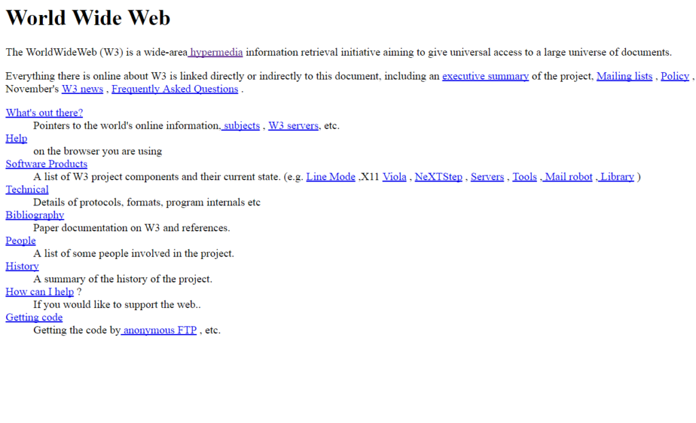
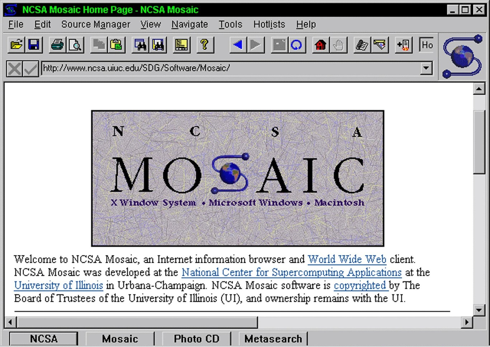
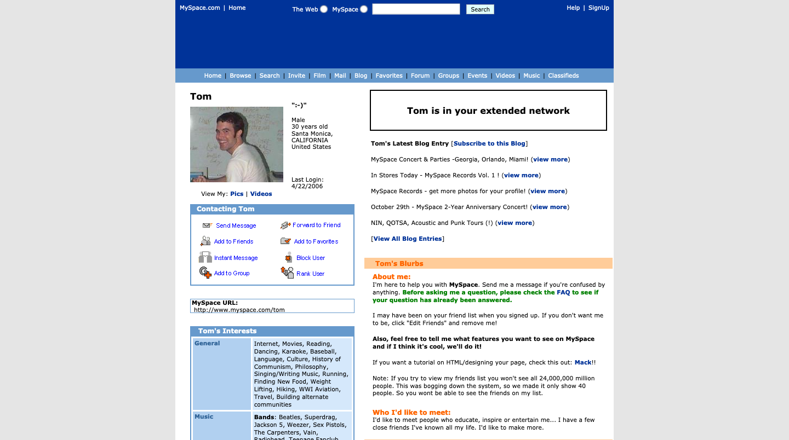

<b>Hubo un tiempo en Internet, por allá a finales de los 90 y principios de los 2000, donde era muy fácil encontrarse con ingentes cantidades de espacios personales web creados por individuos. Una suerte de habitaciones personales dentro del ciberespacio. En estas pequeñas parcelas digitales, cualquiera podía compartir sus pasiones, pensamientos e intereses, sin necesidad de depender de redes sociales o plataformas centralizadas.

Estos sitios, alojados en plataformas como Geocities, Tripod o similares, ofrecían un sinfín de contenidos inesperados: desde información curiosa hasta fansites dedicados a bandas musicales, anime y otras formas de arte.

¿No me creen? ¡Vean! <https://oneterabyteofkilobyteage.tumblr.com/> 

Cada una de estas páginas era un festín visual caótico, lleno de GIFs extravagantes, enlaces rotos, música MIDI estridente y los omnipresentes obreros con casco que advertían que el sitio estaba en un estado permanente de "en construcción". Todo ello conformaba una experiencia visual lisérgica única en cada visita.
 

**Pero, ¿qué cambió? ¿Cuándo y por qué desaparecieron estos rincones personales de la web?**

</b>

<!--more-->

## Un poco historia

El 6 de agosto de 1991 se presentó al mundo el primer sitio web (aún en línea) <https://info.cern.ch/hypertext/WWW/TheProject.html>. En él se podían aprender las primeras formas del lenguaje de marcas de hipertexto (también conocido como HTML) que es el componente más básico de la Web y sirve para dotar de significado y estructura su contenido. 

Sus orígenes se remontan a la necesidad creciente de la comunidad científica y académica de intercambiar información de manera automatizada. El informático Tim Berners-Lee publicó el primer código fuente del navegador Nexus. Aunque, no fue hasta la aparición del navegador Mosaic —que posteriormente daría origen a Netscape— cuando se popularizó el uso de este tipo de software, revolucionando el acceso a la información, el entretenimiento e incluso la manera en que nos relacionamos.

Este protocolo, junto con el Internet Relay Chat (IRC), fue clave en la expansión de la comunicación en línea en los primeros días de Internet. Así nació la World Wide Web. Un espacio inicialmente descentralizado y abierto donde cualquiera podía construir su propio sitio sin intermediarios.

## La democratizacion de la creacion web. Como Geocities suburbanizo internet.

### El boom de las páginas web personales.

El auge de GeoCities fue a los finales 90 y principios de los 2000 donde se convirtió en una de las plataformas más populares para la creación de sitios web personales. Su propuesta era simple pero revolucionaria. Cualquier persona sin necesidad de conocimientos avanzados podía construir su propio rincón en Internet de manera gratuita. La necesidad de organizar este vasto ecosistema hacía que los sitios se agrupasen en "vecindarios" temáticos, asignando a cada usuario una dirección dentro de estos barrios digitales. Había comunidades dedicadas a la música, la ciencia ficción, los deportes y prácticamente cualquier tema imaginable.

### Construcción del self en línea.

Antes de que existieran redes sociales, la identidad digital se forjaba en estos espacios personales. Cada usuario diseñaba su página para reflejar sus intereses, personalidad y gustos. Desde la elección de colores y fondos hasta la inclusión de imágenes, música MIDI y diarios en línea, cada sitio era una expresión única de su creador. Era la era de los GIFs parpadeantes, los fondos estrellados y las páginas "en construcción" que, en lugar de ser un defecto, formaban parte del encanto de la época.

### Creatividad y experimentación.

La falta de plantillas prediseñadas convertía a cada página en un pequeño experimento visual único. No existían reglas estrictas ni algoritmos que dictaran qué funcionaba mejor o peor. Algunos diseños eran extravagantes y caóticos. Otros, con combinaciones de colores imposibles y elementos en constante movimiento. Eso formaba parte del espíritu de la web de los 90: una explosión de creatividad sin filtros ni restricciones.

### Comunidad en línea.

Más allá del diseño, GeoCities fomentó la creación de comunidades digitales. No era solo un alojamiento web, sino una ciudad virtual donde los usuarios podían explorar páginas de otros, dejar mensajes en libros de visitas y compartir enlaces a sitios afines. Había una sensación real de pertenencia, una especie de vecindario digital en el que los intereses comunes unían a extraños de todo el mundo.

### Un legado que perdura.

Aunque GeoCities cerró en 2009, su impacto sigue notándose. No solo marcó una etapa en la evolución de la web, sino que ayudó a consolidar la idea de que Internet podía ser un espacio de expresión personal, descentralizado y comunitario. Hoy en día, iniciativas como el [Web Revival Movement](https://thoughts.melonking.net/guides/introduction-to-the-web-revival-1-what-is-the-web-revival) intentan recuperar ese espíritu reivindicando la idea de que la web es algo más que redes sociales y grandes plataformas.

## Del sitio web personal a la web centralizada.

El cambio comenzó de forma gradual. Con la inexorable masificación del acceso a Internet, la necesidad de herramientas más accesibles se hizo evidente. Surgieron servicios como MySpace y Blogger que simplificaban la creación de páginas personales, ofreciendo plantillas y estructuras predefinidas que eliminaban la necesidad de aprender HTML.

Este cambio trajo consigo una sutil transformación. En lugar de sitios web completamente personalizados, los usuarios comenzaron a adaptarse a los formatos y limitaciones impuestas por estas plataformas. MySpace aún permitía cierta personalización, con fondos y música de perfil, pero ya no era una web realmente descentralizada.

El golpe definitivo llegó con Facebook y Twitter. Estas redes sociales eliminaron por completo la necesidad de gestionar un sitio propio, estableciendo  un nuevo estándar. El feed infinito. Diseñado para el consumo rápido de contenido en lugar de la exploración pausada de espacios personales. La identidad digital dejó de estar en manos del usuario y pasó a estar controlada por algoritmos cuyo objetivo no era fomentar la creatividad, sino maximizar el tiempo de permanencia en la plataforma.

Hoy, la mayoría de las personas ya no tienen un sitio propio. En su lugar, su presencia digital se limita a perfiles en redes sociales, donde la expresión personal se reduce a unas pocas opciones prediseñadas:  una foto de perfil, una biografía breve y publicaciones sometidas al escrutinio de un algoritmo opaco.

## Recuperemos la web personal.

Pero no todo está perdido. Si algo aprendimos en la era de GeoCities es que Internet puede ser más que un puñado de plataformas centralizadas. Existen herramientas como [Neocities](https://neocities.org/), [WordPress](https://wordpress.com/) o incluso [GitHub Pages](https://github.com/) que permiten a cualquiera recuperar el control sobre su presencia en la web.

Tener un sitio web propio es un acto de resistencia digital. Es recuperar el derecho a expresarnos sin restricciones. Sin depender de los caprichos de un algoritmo o los términos de servicio de una corporación. No es necesario ser un experto en código para hacerlo. Basta con la voluntad de crear un espacio propio. Una parcela digital que nos pertenezca de verdad.

Así que aquí está mi invitación. Si alguna vez tuviste un sitio web personal y lo abandonaste, ¿por qué no volver a crearlo? Y si nunca tuviste uno, ¿qué mejor momento que ahora para empezar?

La web es un territorio vasto, y aún hay espacio para la creatividad, la experimentación y la verdadera expresión personal.

**¡Aquí está el mío! Hello, World!**

